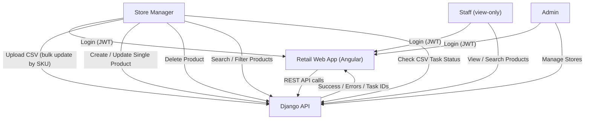

```mermaid
graph TD
    SM[Store Manager] -->|"Login (JWT)"| Web["Retail Web App (Angular)"]
    Viewer["Staff (view-only)"] -->|"Login (JWT)"| Web
    Admin[Admin] -->|"Login (JWT)"| Web
    Web -->|REST API calls| API[Django API]
    SM -- Upload CSV (bulk update by SKU) --> API
    SM -- Create / Update Single Product --> API
    SM -- Delete Product --> API
    SM -- Search / Filter Products --> API
    Viewer -- View / Search Products --> API
    SM -- Check CSV Task Status --> API
    Admin -- Manage Stores --> API
    API -->|Success / Errors / Task IDs| Web
```