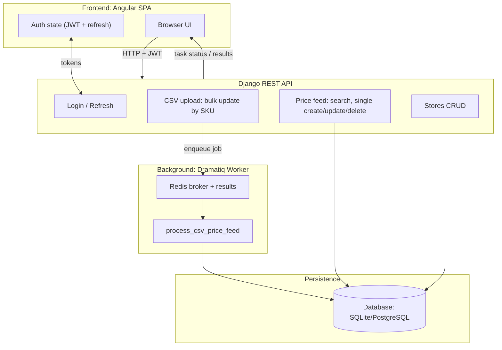

```mermaid
graph TB
  subgraph Client[Frontend: Angular SPA]
    Browser[Browser UI]
    AuthState["Auth state (JWT + refresh)"]
  end

  subgraph API[Django REST API]
    Auth[Login / Refresh]
    Products[Price feed: search, single create/update/delete]
    CSVUpload[CSV upload: bulk update by SKU]
    Stores[Stores CRUD]
  end

  subgraph Async[Background: Dramatiq Worker]
    Queue[Redis broker + results]
    CSVWorker[process_csv_price_feed]
  end

  subgraph Data[Persistence]
    DB[(Database: SQLite/PostgreSQL)]
  end

  Browser -->|HTTP + JWT| API
  AuthState <-->|tokens| Auth
  CSVUpload -->|enqueue job| Queue
  Queue --> CSVWorker
  CSVWorker --> DB
  Products --> DB
  Stores --> DB
  API -->|task status / results| Browser
```